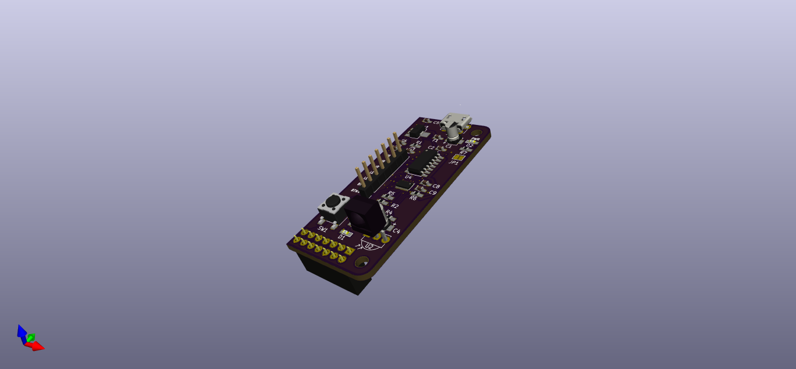
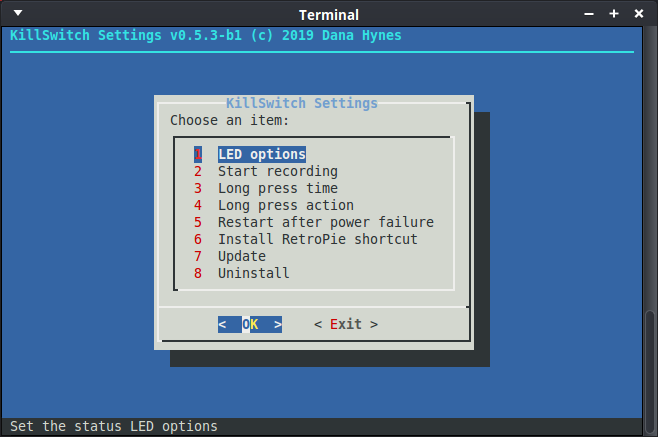
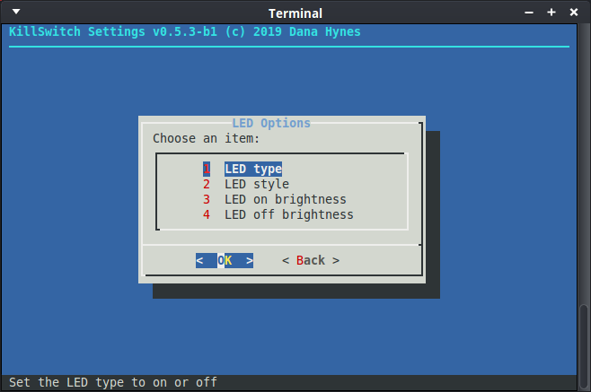

# KillSwitch

Source code and binaries for the KillSwitch project


## About
KillSwitch is a small PCB that attaches to your Raspberry Pi 2/3/4/0 (40 pin GPIO) and allows you to turn the Pi on or off using a push button or an IR remote. It is compatible with almost any infrared remote control, or IR blaster devices like the [Harmony Hub](https://www.logitech.com/en-us/product/harmony-hub) or
[SparkFun WiFi IR Blaster](https://www.sparkfun.com/products/15031). It has been tested with Raspbian and RetroPie. There are three parts to KillSwitch:

1. The hardware (the actual PCB)
2. The software (code that runs on the Raspberry Pi)
3. The firmware (code that runs on the PCB)

## Hardware
The first thing you need is the actual circuit board. The KillSwitch hardware files are included in the download, including a schematic and a PCB layout in KiCad 5 for both the Raspberry Pi 2/3/4 and the Zero. You can get the PCB made by the vendor of your choice (I used OSH Park, hence the purple PCB in the picture above) or breadboard it using the schematic.

## Software installation
To download and install the KillSwitch software on your Pi, first go to the [latest release](https://github.com/danahynes/KillSwitch/releases/latest). Click the link for the "Source code (zip)" or "Source code (tar.gz)" file. Download and extract the file. Then open a terminal, ```cd``` to the KillSwitch-N.N.N/Software/Bash folder, and type:
~~~~
sudo ./killswitch-install.sh
~~~~

Here is a one-line command that will do everything for you:
~~~~
cd && curl -O https://raw.githubusercontent.com/danahynes/KillSwitch/master/killswitch-install-latest.sh && bash killswitch-install-latest.sh
~~~~
You can safely delete the "killswitch-install-latest.sh" file in your home folder after rebooting.

You can also clone the latest "bleeding edge" code by running this command:
~~~~
git clone https://github.com/danahynes/KillSwitch
~~~~
then ```cd``` into the KillSwitch/Software/Bash folder and type:
~~~~
sudo ./killswitch-install.sh
~~~~

The software requires an OS of Raspbian Jessie or newer, or any other OS that
uses "systemd". If you're not sure, Google is your friend -)

## A note on the Pi serial ports
The Raspberry Pi has two UARTs, one based on hardware, and one based on software.

The hardware UART is faster and more reliable, since the silicon is specifically designed to do one thing, and one thing only, and do it well. On the Raspberry Pi 3 (and newer), this port is, by default, used for Bluetooth for obvious reasons.

The software UART on the Pi is normally used for serial login (the ability to log into, and control, the Pi over a wired RS-232 serial connection). This port is reconfigured by KillSwitch to allow communication between the device and the Pi.

That means that installing the software will turn off your ability to log in to the Pi using a serial console (getty/putty), as the software serial port (physical pins 8 and 10, labeled BCM 14 & BCM 15, and in Linux is known as /dev/ttyS0) is used to communicate to the device when using the settings script. If you don't know what this means, don't worry. You'll probably never use this feature. This does not affect the ability to use SSH or VNC to connect to the Pi, only to log in using getty or putty over a physical serial connection.

## Firmware installation
XXXXXXXXXXXXXXXXXXXXXXXXXXXXXXXXXXXX\
THIS DOES NOT WORK - NEED TO PROGRAM ATTINY BEFORE FIRST USE\
XXXXXXXXXXXXXXXXXXXXXXXXXXXXXXXXXXXX\
To install the firmware for the first time, you do not need a programmer, you can use the settings menu on the Pi. Make sure that the software is correctly installed on the Pi, then attach the KillSwitch device to your Pi. **Make sure to plug the power cord into the Pi, not the KillSwitch.** Open a terminal and type "killswitch-settings.sh". Then select the "Update" menu item. This will install/update the firmware on your device and the software on your Pi, if necessary.

## First use
To set up your KillSwitch for the first time, follow these steps:
1. After following the above steps to install the software and firmware, attach the KillSwitch to your Pi and plug the power source in to the KillSwitch. The KillSwitch device uses the same USB Micro B power supply that the Pi uses, so you just have to move the plug from the Pi to the KillSwitch.
2. Press and hold the push button on the device until the LED flashes rapidly (The default is 5 seconds, but this can be changed using the Settings program, see below). Release the button.
3. Point the remote at the device's IR receiver and press the button on the remote that you want to use as the "On" button (note that you have 15 seconds before the device exits the programming mode). The status LED will flash once slowly, then flash rapidly again.
4. Press the button on the remote that you want to use as the "Off" button (again, you have 15 seconds before the device exits programming mode). It can be the same as the "On" button if you wish, creating a "toggle" button. The status LED will flash twice slowly, then turn off.

During programming, the button works in the following ways:
* If the button is held for Long Press Time, exit Programming mode, leaving any unrecorded codes unchanged.
* If the button is pressed quickly, and you are currently recording the "On" code, the "On" code is left unchanged, and Programming is set to record a new "Off" code ("Skip code" in the table below).
* If the button is pressed quickly, and you are currently recording the "Off" code, the Programming mode is exited, and the new "Off" code is the same as the previously recorded "On" code ("Copy code" in the table below).

That's it! Your KillSwitch will now turn power on to the Pi when you press the "On" remote button, or press the hardware button once, and will safely shut down and power off when you press the "Off" remote button (or the "On" button again, if the buttons are the same), or press the hardware button again.

To change the remote codes, you can either shut down the Pi and repeat the steps above, or you can use the Settings program by typing in a terminal "killswitch-settings.sh" and selecting the "Start recording" option.

## Button operation
The hardware button on the KillSwitch device serves different purposes, depending on the state of the device and the Pi it is attached to. Here are its functions:

| Pi is             | Button press | Button hold      |
|-------------------|--------------|------------------|
| Off               | Pi boot      | Program mode     |
| On                | Pi shutdown  | Reboot/Force Off |

| KillSwitch is     | Button press | Button hold      |
|-------------------|--------------|------------------|
| Programming "On"  | Skip code    | Exit programming |
| Programming "Off" | Copy code    | Exit programming |

The hold time is configurable using "killswitch-settings.sh" and selecting the "Long Press Time" option. By default it is 5 seconds. The action of reboot/force off is also configurable through "killswitch-settings.sh", and selecting the "Long Press Action" option. The default is reboot.

## Settings
\
The KillSwitch device can be configured by opening a terminal and typing "killswitch-settings.sh" (or selecting the "KillSwitch" item from the RetroPie main menu). You can press "ESC" at any time to quit the program (Any current changes will not be saved).\
The following settings are available:

#### LED options
\
The LED on the KillSwitch is arguably the most configurable part of the device. Here you can set different options for the status LED on the KillSwitch.

###### LED type
* On (default) - the LED is at the "On" brightness when the Pi is on, and at the "Off" brightness when the Pi is off. You can set the "Off" brightness to a low value to have a dim "Standby" indicator, or 0 (the default) for completely off.
* Off - the LED is always off, unless the device is being programmed.

###### LED style
* Flash (default) - the LED flashes sharply from "On" brightness to completely off during bootup and shutdown.
* Pulse - the LED uses PWM to fade from completely off to "On" brightness and back to completely off during bootup and shutdown, giving a warm "glow" effect.

###### LED on brightness
Sets the brightness of the LED, from 0 to 255, when the LED flashes/pulses during the bootup/shutdown process or when the Pi is fully booted and running. Note that this setting does not affect the brightness of the LED during programming. The default is 255.

###### LED off brightness
Sets the brightness of the LED, from 0 to 255, when the Pi is completely shut down and powered off. The default is 0.

#### Start recording
Select this item and read the instructions that follow (or read the above section on "First use") to program the device to recognize new infrared remote commands to turn the Pi on and off.

#### Long press time
This setting determines how long, in seconds (from 1 to 10), the physical push button on the device must be held down to either start recording new codes, or reboot/force quit the Pi. The default is 5 seconds.

#### Long press action
Here you can set what happens when the physical push button on the device is held down for the Long Press Time when the Pi is running (see above). Holding the button down when the Pi is off will always enter programming mode.
* Reboot (default) - sends the "reboot" command the the Pi, which will safely shut down and restart. If the Pi is not responding, holding down the button may have no effect and you will need to remove the power plug from the device, or remove the device from the Pi to shut it off.
* Force quit - if you prefer to have the device cut the power completely to the Pi when it is not responding (same as pulling out the power plug), set this option. This option is useful if the power plug is not easily accessible, but the physical button is (for instance, an enclosure where the button is custom-mounted in a different location, see the below section about connector "J2").

#### Restart after power failure
This option lets you decide if the Pi is rebooted after an unexpected power failure. If this option is selected, and the the Pi was running, and power to the device was lost without a proper shutdown, KillSwitch will automagically boot the Pi once power is restored. If the option is unselected, you will need to use the physical button/remote button to turn the Pi back on after power is restored. This is a very handy feature if the Pi is used as a file/media server, or the button/power supply is inaccessible.

Note that the whole point of KillSwitch is that it is unsafe/unwise to simply remove power from the Pi without a safe shutdown. Therefore, the device will restore power to the Pi and attempt to boot it, however if the SD card in the Pi was corrupted during the power loss, it may not boot. The device will only restore power to the Pi, after that it's up to the Pi (and the integrity of its SD card) to decide if it will actually boot up.

This also applies to the sections above about reboot/force quit. The KillSwitch device only handles power, and can not adjust for SD card corruption. Your Mileage May Vary.

#### Install RetroPie shortcut
This option is used to place a shortcut named "KillSwitch" in the "Configuration" menu of RetroPie and allows you to access the Settings program using a plugged in/paired controller.

#### Update
This setting will attempt to update the software on your Pi, as well as the firmware in the device itself. It requires an internet connection to check for the latest release of the code on GitHub, then compares the GitHub version number to the version number running on the Pi/KillSwitch. If a newer version is available, you will be asked to confirm the update. The software will attempt to reprogram the device using ICSP, and then run the new installer.

If the update is successful, the Pi will ask to be rebooted. Press "Enter" at the end of the installer, wait for the reboot, and you'll be good to go!

Note that if you are using RetroPie, you will need an attached/paired keyboard to complete the process.

#### Uninstall
This one is pretty self-explanatory. It uninstalls almost all the files/folders from your Pi that were installed using the installer. If you use this option, please be sure to read the caveats at the end of the uninstall script output, as there are some things the uninstaller cannot revert, such as installed dependencies and the serial port options.

Note that if you are using RetroPie, you will need an attached/paired keyboard to complete the process.

## RetroPie
The software installed on your Pi is compatible with RetroPie. Where you see "killswitch-settings.sh" above, select "KillSwitch" from the main configuration menu.

When you install the software on a system that has RetroPie, a shortcut to "killswitch-settings.sh" will be installed in the main menu directory as "KillSwitch", where you can access it and use it with a paired game controller. Use the D-Pad to navigate between menu options, and the A/B buttons to accept/cancel. (So far it is tested on a Pi 3 B+ with RetroPie v4.4, but it should work on any newer Pi hardware and RetroPie software).

Specific buttons to use depend on your setup, but the defaults are that the A button is Enter (select OK/Back/Exit), and the B button is space bar (select option).

## Connectors
The connector labeled "J2" has 7 pins. These pins can be used to remotely locate the button/status LED/IR receiver. Starting with the pin closest to the physical push button, they are:

| Pin # | Label  | Connection                 |
|-------|--------|----------------------------|
| 1     | BTN +  | Physical push button +3.3v |
| 2     | BTN -  | Physical push button GND   |
| 3     | LED +  | Status LED +3.3v           |
| 4     | LED -  | Status LED GND             |
| 5     | IR +   | IR receiver +3.3v          |
| 6     | IR SIG | IR receiver signal         |
| 7     | IR -   | IR receiver GND            |

The connector labeled "J3" has 14 pins. These pins are normally used to connect to the Raspberry Pi's 40 pin GPIO header, but they can be used to remotely connect the device to the Pi, if necessary. The pins are numbered odd-even, starting from pin 1 (top right, when viewed from above, closest to the mounting hole). Looking at the connector from the top of the board, they are numbered:

|    |    |    |   |   |   |   |          |
|----|----|----|---|---|---|---|----------|
| 13 | 11 | 9  | 7 | 5 | 3 | 1 | Mounting |
| 14 | 12 | 10 | 8 | 6 | 4 | 2 | Hole ( ) |

| Pin # | Label  | Connection    |
|-------|--------|---------------|
| 1     | +3v3   | no connection |
| 2     | +5v    | +5v to the Pi |
| 3     | BCM 2  | FEEDBACK      |
| 4     | +5v    | +5v to the Pi |
| 5     | BCM 3  | TRIGGER       |
| 6     | GND    | GND           |
| 7     | BCM 4  | RESET (ICSP)  |
| 8     | BCM 14 | RX            |
| 9     | GND    | GND           |
| 10    | BCM 15 | TX            |
| 11    | BCM 17 | MOSI (ICSP)   |
| 12    | BCM 18 | MISO (ICSP)   |
| 13    | BCM 27 | SCK  (ICSP)   |
| 14    | GND    | GND           |

FEEDBACK and TRIGGER are the connections used to sync the KillSwitch device to the Pi. TX and RX are the connections used to communicate between the device and the Pi when using the killswitch-settings app. ICSP connections are used to update the firmware on the device. +5v and GND are the connections used to power the Pi.

There is also a small set of jumper pads near the USB connector, labeled "JP1". These pads control whether the Power indicator LED is enabled. To enable the LED to indicate whether power is applied to the KillSwitch, place a small solder blob across these two pads. To disable the Power indicator LED, remove the solder blob.

The status LED on the KillSwitch can be disabled using the Settings app, as stated above. You can also turn off the Pi's power and activity LEDs for a truly "dark" experience using this link: https://www.jeffgeerling.com/blogs/jeff-geerling/controlling-pwr-act-leds-raspberry-pi (not tested, YMMV)

## Source code
The source code is arranged as an [Atom](https://ide.atom.io) project and the firmware is built using the [PlatformIO](https://platformio.org) plugin.

XXXXXXXXXXXXXXXXXXXXXXXXXXXXXX\
NEED TO PUT THIS REPO BACK UP\
XXXXXXXXXXXXXXXXXXXXXXXXXXXXXX\
If you want to compile the source for the firmware yourself, you'll also need to download the [Arduino-Libraries repo](https://github.com/danahynes/Arduino-Libraries/releases/latest).
You may also need to adjust the relative paths of the library file links in the Firmware/src/ folder since I use symlinks to the library files that reside outside this project. (I don't like having to copy/paste library directories every time I change something in one of them, so symlinks just pull in the latest version of a header or source file, from where it lives in a different repo folder on my build system. I know this isn't the most "correct" way to do it, and I could write a script to automate it or create Arduino packages, and maybe I will, but hey, for now... it works!)

## Licensing
KillSwitch makes use of the [IRremote library](https://github.com/z3t0/Arduino-IRremote) by Ken Shirriff, et al.
See Firmware/lib/IRremote/README.md for more info.

All other source code for the firmware, hardware, and software is copyright (c) 2019 Dana Hynes, and is licensed under the WTFPL v2. See the LICENSE file or http://www.wtfpl.net/ for more info.

Happy hacking!

# -)
